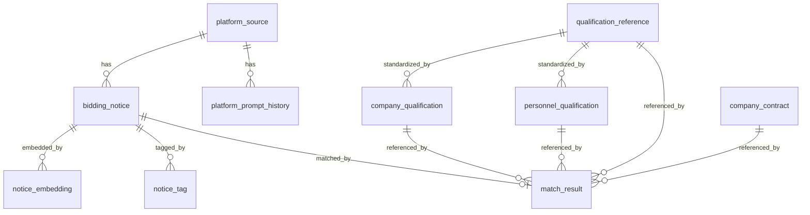
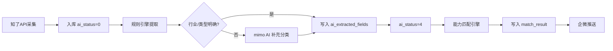

# 客户雷达 — 技术设计文档

> 版本: v2.0 | 日期: 2026-07-03 | 基于 PRD v2.0 修正
> 版本: v3.0 | 日期: 2026-07-04 | 基于 Phase B 实际验证修正
---

## 1. 项目定位

为广东励康信息技术有限公司搭建一套 **招投标情报采集与商机匹配系统**。核心设计理念：

- **业务驱动**：运维/驻场是现金牛，系统围绕这个核心来建
- **AI 原生**：数据库从第一行 DDL 开始就为 LLM 优化，让 AI Pipeline 以最低 Token 成本处理数据
- **匹配为核心**：不只是“看标讯”，而是基于公司能力评估与标讯需求的契合度

### 数据源约束（重要）

**知了标讯 API 只返回元数据，不含招标文件正文。** 实际返回字段：title、bid_type、money_wan、province、city、caller_name、agency_name、sm_names、signup_time、tender_time、url、exists_bid_file 等。`notice_content` 在入库时为空。

**招标文件（含资质要求、评分标准）在原发布网站。** 标讯中的 url 指向知了标讯的中转页面，原发布网站链接在该页面内。获取招标文件的方式因平台而异：

| 获取方式 | 说明 | 处理策略 |
|---|---|---|
| 免费下载 | 部分政府平台直接提供 PDF/Word | 优先获取，提取资质要求 |
| 需要报名 | 需注册并报名后才能下载 | 标记为 `registration_required`，人工跟进 |
| 收费购买 | 招标文件需付费获取 | 标记为 `paid`，跳过 |
| 无法获取 | 链接失效或需特殊权限 | 标记为 `unknown` |

**这意味着：**
1. AI Pipeline 无法从标讯中提取资质要求和评分标准（因为没有招标文件正文）
2. 匹配引擎无法做“逐项扣分”式的精确匹配（不知道具体要求是什么）
3. 当前匹配改为“能力契合度评估”：基于公司已有能力与标讯特征的重叠度打分

---

## 2. 技术选型

| 层 | 选型 | 理由 |
|---|---|---|
| 前端 | React 18 + Vite + shadcn/ui + Tailwind CSS | 国际化视觉质感，源码级样式可控，响应式灵活 |
| 后端 | Node.js + Express | 与已有项目经验一致 |
| 数据库 | Supabase (PostgreSQL 15+) | 已有经验，RLS/Auth 内置 |
| AI 模型 | 小米 mimo-v2.5-pro | 结构化提取能力强，中文优化好 |
| 全文搜索 | pg_trgm + GIN 索引 | 中文模糊搜索，免装额外插件 |
| 推送 | 企微群机器人 webhook | 零门槛，一行代码 |
| 定时调度 | node-cron | 轻量无依赖 |

---

## 3. 表结构概览

```
platform_source              -- 平台源信息及技术画像（为爬虫扩展预留）
platform_prompt_history      -- 提示词版本历史
bidding_notice               -- 招投标公告（核心数据表）
notice_tag                   -- AI 标签（行级存储）
notice_embedding             -- 向量嵌入（第二阶段）
company_qualification        -- 公司资质证书
personnel_qualification      -- 人员资质证书
match_result                 -- 资格匹配结果
qualification_reference      -- 常用资质参考库（种子数据）
company_contract             -- 公司业绩/合同（同类经验匹配）
```

### 3.1 ER 关系



### 3.2 platform_source — 平台画像

记录每个招标网站的技术特征，供爬虫调度动态决策（第二阶段使用）。

关键字段：
- `spider_strategy` — 爬虫策略标识
- `spider_config` — 爬虫配置 JSON
- `extraction_prompt` + `prompt_version` — 该平台定制化的提取提示词

### 3.3 bidding_notice — 核心数据表

**知了 API 只返回元数据，不含标讯正文。** 字段清单：

| 字段 | 内容 | 来源 |
|---|---|---|
| `title` | 标题 | 知了 API |
| `notice_type` | tender/result/change/candidate | 知了 API bid_type 映射 |
| `budget_amount` | 预算（万元） | 知了 API money_wan |
| `region_scope` / `city` | 省份/城市 | 知了 API |
| `tenderee` | 采购单位 | 知了 API caller_name |
| `tender_agent` | 代理机构 | 知了 API agency_name |
| `source_url` | 知了中转页链接 | 知了 API url |
| `signup_time` | 报名截止 | 知了 API |
| `notice_content` | **始终为空** | 知了 API 不返回正文 |
| `cleaned_content` | **始终为空** | 同上 |
| `ai_extracted_fields` | AI 结构化提取结果 (JSONB) | AI Pipeline v2 写入 |
| `ai_status` | 处理状态 | AI Pipeline 写入 |
| `industry_type` | 行业分类 | AI Pipeline 写入 |
| `data_source` | 数据来源（`zhiliao_api`） | 入库时写入 |

**关键约束**：因为 `notice_content` 始终为空，AI Pipeline 不能做内容级提取（如摘要、资质要求、评分规则）。

### 3.4 AI 状态机 (`ai_status`)

```
  0 (待处理)  →  4 (元数据提取完成)
       │
       └→ -2 (处理失败，错误记录在 ai_error)
```

**v1→v2 变更**：原状态机有 0→1→2→3→4 四步（清洗→摘要→打标→完成），因为 `notice_content` 始终为空，清洗和摘要无意义。v2 简化为 0→4 一步完成。状态 1/2/3 不再使用。

### 3.5 company_qualification — 公司资质表

```sql
CREATE TABLE company_qualification (
  id              SERIAL PRIMARY KEY,
  qual_type       VARCHAR(50) NOT NULL,    -- 资质类型：营业执照/ISO9001/ISO27001/ITSS/CS等
  qual_name       VARCHAR(200) NOT NULL,   -- 资质名称
  qual_level      VARCHAR(50),             -- 等级：一级/二级/三级/甲级/乙级
  cert_number     VARCHAR(100),            -- 证书编号
  issue_date      DATE,
  expiry_date     DATE,                    -- 到期日（用于预警）
  issuing_body    VARCHAR(200),            -- 发证机关
  scope           TEXT,                    -- 覆盖范围描述
  is_active       BOOLEAN DEFAULT TRUE,
  created_at      TIMESTAMPTZ DEFAULT NOW(),
  updated_at      TIMESTAMPTZ DEFAULT NOW()
);
```

### 3.6 personnel_qualification — 人员资质表

```sql
CREATE TABLE personnel_qualification (
  id              SERIAL PRIMARY KEY,
  person_name     VARCHAR(50) NOT NULL,    -- 姓名
  qual_type       VARCHAR(50) NOT NULL,    -- 证书类型：PMP/OCP/RHCE/CCIE/HCIE/软考等
  qual_name       VARCHAR(200) NOT NULL,   -- 证书全称
  cert_number     VARCHAR(100),            -- 证书编号
  issue_date      DATE,
  expiry_date     DATE,
  is_active       BOOLEAN DEFAULT TRUE,
  created_at      TIMESTAMPTZ DEFAULT NOW(),
  updated_at      TIMESTAMPTZ DEFAULT NOW()
);
```

### 3.7 qualification_reference — 资质参考库

IT基础设施服务常用资质标准术语库，包含人员认证（10 大类 80+ 项）和企业资质（5 大类 30+ 项）。

**AI 友好设计：**
- `qual_name` — 标准术语，AI 提取后直接写入
- `match_keywords` — AI 在公告中匹配的关键词数组（如 OCP 匹配 ["Oracle OCP", "OCP证书", "数据库管理员"]）
- `common_aliases` — 常见别名/简称（如 OCP 别名 Oracle认证DBA）
- `search_vector` — GIN 索引，支持模糊匹配

用途：
- 匹配引擎：标准化资质名称对照 + 关键词匹配
- 前端下拉菜单：常用资质选项
- AI 提取：标准术语参考 + 关键词引导

关键字段：
- `category` — 大类（personnel / company）
- `subcategory` — 子类（如服务器与操作系统、IT服务类）
- `qual_name` — 资质/认证名称（标准术语）
- `issuer` — 发证机构
- `match_keywords` — AI 匹配关键词（TEXT[] 数组）
- `common_aliases` — 常见别名（TEXT[] 数组）

### 3.8 company_contract — 公司业绩/合同表

供匹配引擎查询同类项目经验。合同原件由用户本地管理，Hermes Agent 提取结构化数据后通过 CLI/API 写入。

关键字段：
- `service_type` — 服务类型（运维/驻场/集成/桌面/维保/咨询）
- `tech_keywords` — 技术关键词数组，匹配引擎直接使用
- `industry` — 行业分类（银行/医院/政府/交通/电力等）
- `start_date` / `end_date` — 合同起止日期，用于"近N年"判断
- `raw_text` — 合同关键文本，供 AI 匹配时参考
- `ai_extracted` — AI 提取完整结果 JSONB
- `source_file` — 原始文件名，用于本地文件索引

### 3.9 AI 友好字段汇总

| 表 | 字段 | 用途 |
|---|---|---|
| bidding_notice | ai_status | AI 处理状态 (0=待处理, 4=完成, -2=失败) |
| bidding_notice | ai_extracted_fields | AI 提取结果 JSONB (来源标记 source=metadata_rules/metadata_rules+ai) |
| bidding_notice | industry_type | 行业分类 (AI Pipeline 写入) |
| notice_tag | tag_type + tag_value | 标签 (tech_keyword/industry/project_type) |
| notice_tag | confidence | 提取置信度 (0.00-1.00) |
| match_result | match_details | 五维匹配详情 JSONB (维度/得分/满分) |
| match_result | risk_notes | 风险提示 TEXT[] |
| match_result | total_deduction | 距满分差值 (100 - 实际得分) |
| company_contract | tech_keywords | 合同技术关键词，匹配引擎直接使用 |
| company_contract | industry | 合同行业，匹配引擎直接使用 |

### 3.9 match_result — 匹配结果表

```sql
CREATE TABLE match_result (
  id              BIGSERIAL PRIMARY KEY,
  notice_id       BIGINT NOT NULL REFERENCES bidding_notice(id) ON DELETE CASCADE,
  total_deduction DECIMAL(5,2) DEFAULT 0,  -- 预估总扣分
  recommend_level VARCHAR(20) NOT NULL     -- strong/yes/risky/no
    CHECK (recommend_level IN ('strong', 'yes', 'risky', 'no')),
  match_details   JSONB NOT NULL,          -- 逐项匹配详情
  unmatched_items JSONB,                   -- 不满足的条件列表
  risk_notes      TEXT[],                   -- 风险提示
  calculated_at   TIMESTAMPTZ DEFAULT NOW(),
  UNIQUE (notice_id)
);
```

**v2 变更说明**：
- `total_deduction` 语义变更：v1 表示“资质缺失扣分总和”，v2 表示“100 - 能力匹配得分”（兼容旧字段名）
- `match_details` 结构变更：v1 为 `{requirement, matched, deduction}`，v2 为 `{dimension, score, max_score, matched, ...}`
- `unmatched_items`：v2 中不再使用（匹配结果全部在 match_details 中）

---

## 4. AI Pipeline 流程



### 4.1 各阶段详情

**阶段 1：采集与入库**
- 知了标讯 API 按关键词拉取公告（默认广东省）
- 字段映射 + 去重（source_unique_id）
- 写入 bidding_notice，`ai_status = 0`，`notice_content = ''`

**阶段 2：元数据提取（规则引擎 + AI 补充）**

规则引擎从标题+sm_names 提取（无需 AI，快速免费）：
- 技术关键词：14 种模式（小型机/存储/数据库/服务器/网络/虚拟化/桌面/安全/云/机房/ERP/监控/备份/容器）
- 行业分类：8 种模式（金融/医疗/电力能源/交通/教育/政府/通信/制造业）
- 项目类型：7 种模式（运维/驻场运维/桌面运维/系统集成/咨询/安全服务/培训）

仅当规则引擎无法确定行业或项目类型时，调用 mimo AI 补充分类。

**不提取的字段**（因为没有招标文件正文）：
- ~~资质要求 (qualification_requirements)~~
- ~~评分标准 (commercial_scoring_rules)~~
- ~~摘要 (notice_summary)~~

写入 `ai_extracted_fields`，`ai_status → 4`。

**阶段 3：能力匹配引擎（五维评分，满分 100）**

因为没有招标文件的资质要求，无法做“逐项扣分”式匹配。改为评估公司已有能力与标讯需求的契合度：

| 维度 | 满分 | 匹配逻辑 |
|---|---|---|
| 技术关键词 | 30 | 标讯 tech_keywords 与公司资质 scope/名称 + 合同 tech_keywords 的重叠比例 |
| 行业经验 | 25 | 标讯 industry_type 是否在公司合同的 industry 中出现 |
| 项目类型 | 20 | 标讯 project_type 是否在公司合同的 service_type 中出现 |
| 地区匹配 | 15 | 标讯 region 是否在公司合同的 region 中出现（广东省内各市互通） |
| 同类业绩 | 10 | 是否有近 3 年同类合同（服务类型+行业+技术关键词至少匹配 2 项） |

推荐等级：
```
总分 >= 80: 'strong'（强推）
总分 >= 60: 'yes'   （可以投）
总分 >= 40: 'risky' （风险）
总分 <  40: 'no'    （不建议）
```

**当前数据验证**（226 条标讯）：7 strong / 54 yes / 122 risky / 43 no

### 4.2 招标文件获取（第二阶段）

当前阶段匹配基于元数据做能力契合度评估。如需精确的“逐项扣分”匹配，需要获取招标文件正文：

1. 从 `source_url`（知了中转页）找到原发布网站链接
2. 检查获取方式：免费下载 / 需报名 / 收费购买
3. 免费文件：下载 PDF/Word，AI 提取资质要求和评分标准
4. 收费文件：标记 `doc_access_type = 'paid'`，跳过
5. 需报名：标记 `doc_access_type = 'registration_required'`，人工跟进

**约束**：收费招标文件一律跳过并标记，不付费获取。

---

## 5. 查询场景

| 场景 | 走什么索引 | 示例 |
|---|---|---|
| 关键词搜标题 | `pg_trgm` GIN | "涉密 华为" |
| 筛选地区+类型 | 复合索引 | city='广州', type='tender' |
| 按标签查 | `idx_tag_type_value` | qualification='ISO9001' |
| 按匹配等级查 | `idx_match_level` | recommend_level='strong' |
| 流水线调度 | `idx_notice_ai_status_date` | ai_status=0 AND 近7天 |

---

## 6. 文件结构

```
customer radar/
├── docs/
│   ├── prd.md                    ← 需求文档
│   ├── design.md                 ← 本文件
│   ├── platform-registry.md      ← 平台清单
│   ├── prompt-template.md        ← Prompt 模板
│   └── implementation-plan.md    ← 实施计划
├── supabase/
│   └── migrations/
│       ├── 001_init_schema.sql
│       ├── 002_platform_tech_profile.sql
│       ├── 003_enrich_business_fields.sql
│       ├── 004_expand_guangdong_platforms.sql
│       ├── 005_qualification_tables.sql      ← 新增：资质表
│       └── 006_match_result_table.sql        ← 新增：匹配结果表
├── src/
│   ├── server/
│   │   ├── index.js
│   │   ├── config.js
│   │   ├── services/
│   │   │   ├── zhiliao-api.js
│   │   │   ├── ai-pipeline.js
│   │   │   ├── match-engine.js
│   │   │   ├── wecom-notify.js
│   │   │   └── scheduler.js
│   │   └── routes/
│   │       ├── notices.js
│   │       ├── qualifications.js
│   │       ├── match.js
│   │       ├── platforms.js
│   │       └── auth.js
│   ├── client/
│   │   ├── index.html
│   │   ├── src/
│   │   │   ├── App.jsx
│   │   │   ├── pages/
│   │   │   │   ├── Login.jsx
│   │   │   │   ├── ResetPassword.jsx
│   │   │   │   ├── NoticeList.jsx
│   │   │   │   ├── NoticeDetail.jsx
│   │   │   │   ├── QualificationManage.jsx
│   │   │   │   ├── Search.jsx
│   │   │   │   ├── PlatformManage.jsx
│   │   │   │   └── Settings.jsx
│   │   │   ├── components/
│   │   │   └── utils/
│   │   ├── manifest.json
│   │   └── vite.config.js
│   └── cli/
│       ├── bin/
│       │   └── cr.js              ← CLI 入口
│       ├── commands/
│       │   ├── auth.js            ← login/logout
│       │   ├── list.js            ← cr list
│       │   ├── show.js            ← cr show
│       │   ├── search.js          ← cr search
│       │   ├── qual.js            ← cr qual/person
│       │   └── admin/
│       │       ├── qual.js        ← cr admin qual:*
│       │       ├── person.js      ← cr admin person:*
│       │       ├── platform.js    ← cr admin platform:*
│       │       ├── notice.js      ← cr admin notice:*
│       │       ├── push.js        ← cr admin push:*
│       │       └── user.js        ← cr admin user:*
│       ├── lib/
│       │   ├── auth.js            ← 认证工具
│       │   ├── api.js             ← API 请求封装
│       │   └── output.js          ← 输出格式化
│       └── package.json
├── package.json
├── .env
└── .env.example
```
