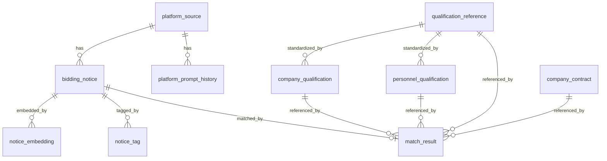
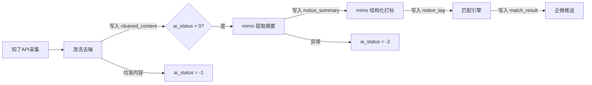

# 客户雷达 — 技术设计文档

> 版本: v2.0 | 日期: 2026-07-03 | 基于 PRD v2.0 修正

---

## 1. 项目定位

为广东励康信息技术有限公司搭建一套 **招投标情报采集与商机匹配系统**。核心设计理念：

- **业务驱动**：运维/驻场是现金牛，系统围绕这个核心来建
- **AI 原生**：数据库从第一行 DDL 开始就为 LLM 优化，让 AI Pipeline 以最低 Token 成本处理数据
- **匹配为核心**：不只是"看标讯"，而是"算能不能投、扣几分"

---

## 2. 技术选型

| 层 | 选型 | 理由 |
|---|---|---|
| 前端 | React 18 + Vite + shadcn/ui + Tailwind CSS | 国际化视觉质感，源码级样式可控，响应式灵活 |
| 后端 | Node.js + Express | 与已有项目经验一致 |
| 数据库 | Supabase (PostgreSQL 15+) | 已有经验，RLS/Auth 内置 |
| AI 模型 | 小米 mimo-v2.5-pro | 结构化提取能力强，中文优化好 |
| 全文搜索 | pg_trgm + GIN 索引 | 中文模糊搜索，免装额外插件 |
| 推送 | 企微群机器人 webhook | 零门槛，一行代码 |
| 定时调度 | node-cron | 轻量无依赖 |

---

## 3. 表结构概览

```
platform_source              -- 平台源信息及技术画像（为爬虫扩展预留）
platform_prompt_history      -- 提示词版本历史
bidding_notice               -- 招投标公告（核心数据表）
notice_tag                   -- AI 标签（行级存储）
notice_embedding             -- 向量嵌入（第二阶段）
company_qualification        -- 公司资质证书
personnel_qualification      -- 人员资质证书
match_result                 -- 资格匹配结果
qualification_reference      -- 常用资质参考库（种子数据）
company_contract             -- 公司业绩/合同（同类经验匹配）
```

### 3.1 ER 关系



### 3.2 platform_source — 平台画像

记录每个招标网站的技术特征，供爬虫调度动态决策（第二阶段使用）。

关键字段：
- `spider_strategy` — 爬虫策略标识
- `spider_config` — 爬虫配置 JSON
- `extraction_prompt` + `prompt_version` — 该平台定制化的提取提示词

### 3.3 bidding_notice — 核心数据表

AI 数据分层存储，逐级降本：

| 字段 | 角色 | Token 成本 |
|---|---|---|
| `notice_content` | 原始 HTML 存档 | 最高（万字级） |
| `cleaned_content` | 纯文本，去噪后 | 中等 |
| `notice_summary` | 200 字摘要 | 极低 |
| `notice_tag`（关联表） | 结构化标签 | 零（不走 LLM） |

补充字段：
- `data_source` — 数据来源标识（`zhiliao_api` / `self_crawler`）

### 3.4 AI 状态机 (`ai_status`)

```
  0 (待处理)
  │
  ├→ 1 (已清洗) → 2 (已摘要) → 3 (已打标) → 4 (全部完成)
  │
  ├→ -1 (AI 判定为噪声)
  │
  └→ -2 (处理失败，错误记录在 ai_error)
```

支持断点续跑：清洗成功但摘要失败时，不需要从头再来。

### 3.5 company_qualification — 公司资质表

```sql
CREATE TABLE company_qualification (
  id              SERIAL PRIMARY KEY,
  qual_type       VARCHAR(50) NOT NULL,    -- 资质类型：营业执照/ISO9001/ISO27001/ITSS/CS等
  qual_name       VARCHAR(200) NOT NULL,   -- 资质名称
  qual_level      VARCHAR(50),             -- 等级：一级/二级/三级/甲级/乙级
  cert_number     VARCHAR(100),            -- 证书编号
  issue_date      DATE,
  expiry_date     DATE,                    -- 到期日（用于预警）
  issuing_body    VARCHAR(200),            -- 发证机关
  scope           TEXT,                    -- 覆盖范围描述
  is_active       BOOLEAN DEFAULT TRUE,
  created_at      TIMESTAMPTZ DEFAULT NOW(),
  updated_at      TIMESTAMPTZ DEFAULT NOW()
);
```

### 3.6 personnel_qualification — 人员资质表

```sql
CREATE TABLE personnel_qualification (
  id              SERIAL PRIMARY KEY,
  person_name     VARCHAR(50) NOT NULL,    -- 姓名
  qual_type       VARCHAR(50) NOT NULL,    -- 证书类型：PMP/OCP/RHCE/CCIE/HCIE/软考等
  qual_name       VARCHAR(200) NOT NULL,   -- 证书全称
  cert_number     VARCHAR(100),            -- 证书编号
  issue_date      DATE,
  expiry_date     DATE,
  is_active       BOOLEAN DEFAULT TRUE,
  created_at      TIMESTAMPTZ DEFAULT NOW(),
  updated_at      TIMESTAMPTZ DEFAULT NOW()
);
```

### 3.7 qualification_reference — 资质参考库

IT基础设施服务常用资质标准术语库，包含人员认证（10 大类 80+ 项）和企业资质（5 大类 30+ 项）。

**AI 友好设计：**
- `qual_name` — 标准术语，AI 提取后直接写入
- `match_keywords` — AI 在公告中匹配的关键词数组（如 OCP 匹配 ["Oracle OCP", "OCP证书", "数据库管理员"]）
- `common_aliases` — 常见别名/简称（如 OCP 别名 Oracle认证DBA）
- `search_vector` — GIN 索引，支持模糊匹配

用途：
- 匹配引擎：标准化资质名称对照 + 关键词匹配
- 前端下拉菜单：常用资质选项
- AI 提取：标准术语参考 + 关键词引导

关键字段：
- `category` — 大类（personnel / company）
- `subcategory` — 子类（如服务器与操作系统、IT服务类）
- `qual_name` — 资质/认证名称（标准术语）
- `issuer` — 发证机构
- `match_keywords` — AI 匹配关键词（TEXT[] 数组）
- `common_aliases` — 常见别名（TEXT[] 数组）

### 3.8 company_contract — 公司业绩/合同表

供匹配引擎查询同类项目经验。合同原件由用户本地管理，Hermes Agent 提取结构化数据后通过 CLI/API 写入。

关键字段：
- `service_type` — 服务类型（运维/驻场/集成/桌面/维保/咨询）
- `tech_keywords` — 技术关键词数组，匹配引擎直接使用
- `industry` — 行业分类（银行/医院/政府/交通/电力等）
- `start_date` / `end_date` — 合同起止日期，用于"近N年"判断
- `raw_text` — 合同关键文本，供 AI 匹配时参考
- `ai_extracted` — AI 提取完整结果 JSONB
- `source_file` — 原始文件名，用于本地文件索引

### 3.9 AI 友好字段汇总

| 表 | 字段 | 用途 |
|---|---|---|
| bidding_notice | ai_status | AI 处理状态机 (0→1→2→3→4/-1/-2) |
| bidding_notice | cleaned_content | 分层存储：原始HTML→清洗文本 |
| bidding_notice | notice_summary | AI 生成的精炼摘要 |
| bidding_notice | ai_extracted_fields | AI 结构化提取完整结果 (JSONB) |
| notice_tag | confidence | AI 提取置信度 (0.00-1.00) |
| company_qualification | qual_ref_id | 关联资质参考库，标准化匹配 |
| company_qualification | match_keywords | AI 匹配关键词数组 |
| personnel_qualification | qual_ref_id | 关联资质参考库，标准化匹配 |
| personnel_qualification | match_keywords | AI 匹配关键词数组 |
| match_result | match_details | 结构化匹配详情 (JSONB) |
| match_result | ai_score_details | AI 辅助评分详情 (JSONB) |
| qualification_reference | match_keywords | AI 匹配关键词数组 |
| qualification_reference | common_aliases | 常见别名数组 |
| qualification_reference | search_vector | 全文搜索向量 (GIN索引) |

### 3.9 match_result — 匹配结果表

```sql
CREATE TABLE match_result (
  id              BIGSERIAL PRIMARY KEY,
  notice_id       BIGINT NOT NULL REFERENCES bidding_notice(id) ON DELETE CASCADE,
  total_deduction DECIMAL(5,2) DEFAULT 0,  -- 预估总扣分
  recommend_level VARCHAR(20) NOT NULL     -- strong/yes/risky/no
    CHECK (recommend_level IN ('strong', 'yes', 'risky', 'no')),
  match_details   JSONB NOT NULL,          -- 逐项匹配详情
  unmatched_items JSONB,                   -- 不满足的条件列表
  risk_notes      TEXT[],                   -- 风险提示
  calculated_at   TIMESTAMPTZ DEFAULT NOW(),
  UNIQUE (notice_id)
);
```

---

## 4. AI Pipeline 流程



### 4.1 各阶段详情

**阶段 1：采集与入库**
- 知了标讯 API 按关键词拉取广东省公告
- 字段映射 + 去重（source_unique_id）
- 写入 bidding_notice，`ai_status = 0`

**阶段 2：清洗**
- 去除 HTML 标签、导航栏、页脚
- 写入 `cleaned_content`，`ai_status → 1`

**阶段 3：摘要生成**
- 读取 `cleaned_content`（不读原始 HTML，省 90% Token）
- mimo-v2.5-pro 返回 200 字商机摘要
- 写入 `notice_summary`，`ai_status → 2`

**阶段 4：结构化打标**
- mimo-v2.5-pro JSON Mode 提取：
  - 项目类型（维保/驻场/桌面运维/算力等）
  - 预算金额
  - 资质要求（逐项列出，标注是否必须）
  - 商务评分规则（逐项列出分值和扣分条件）
  - 技术关键词（IBM小型机、Oracle、存储等）
  - 行业（银行/医院/交通/政府等）
  - 潜在竞争对手
- 写入 `notice_tag`，`ai_status → 3`

**阶段 5：匹配引擎（规则引擎，非 LLM）**

```
输入：notice 的 qualification_requirements + commercial_scoring_rules
     + company_qualification 全量
     + personnel_qualification 全量

逻辑：
1. 遍历每条资格要求
2. 在公司资质库中查找匹配（模糊匹配：qual_name 包含关键词）
3. 在人员资质库中查找匹配（按 qual_type + is_active + expiry_date）
4. 客观分：逐项计算扣分
5. 主观分：按满分的 90% 估算
6. 累加总扣分

输出：
- total_deduction <= 0: recommend_level = 'strong'（强推）
- total_deduction <= 2: recommend_level = 'yes'（可以投）
- total_deduction <= 5: recommend_level = 'risky'（风险）
- total_deduction > 5:  recommend_level = 'no'（不建议）
```

### 4.2 平台级 Prompt 定制（第二阶段）

不同平台行文风格差异大，提取 Prompt 存在 `platform_source.extraction_prompt`，Pipeline 处理时动态拼接：

```
system_prompt + platform.extraction_prompt + cleaned_content
```

---

## 5. 查询场景

| 场景 | 走什么索引 | 示例 |
|---|---|---|
| 关键词搜标题 | `pg_trgm` GIN | "涉密 华为" |
| 筛选地区+类型 | 复合索引 | city='广州', type='tender' |
| 按标签查 | `idx_tag_type_value` | qualification='ISO9001' |
| 按匹配等级查 | `idx_match_level` | recommend_level='strong' |
| 流水线调度 | `idx_notice_ai_status_date` | ai_status=0 AND 近7天 |

---

## 6. 文件结构

```
customer radar/
├── docs/
│   ├── prd.md                    ← 需求文档
│   ├── design.md                 ← 本文件
│   ├── platform-registry.md      ← 平台清单
│   ├── prompt-template.md        ← Prompt 模板
│   └── implementation-plan.md    ← 实施计划
├── supabase/
│   └── migrations/
│       ├── 001_init_schema.sql
│       ├── 002_platform_tech_profile.sql
│       ├── 003_enrich_business_fields.sql
│       ├── 004_expand_guangdong_platforms.sql
│       ├── 005_qualification_tables.sql      ← 新增：资质表
│       └── 006_match_result_table.sql        ← 新增：匹配结果表
├── src/
│   ├── server/
│   │   ├── index.js
│   │   ├── config.js
│   │   ├── services/
│   │   │   ├── zhiliao-api.js
│   │   │   ├── ai-pipeline.js
│   │   │   ├── match-engine.js
│   │   │   ├── wecom-notify.js
│   │   │   └── scheduler.js
│   │   └── routes/
│   │       ├── notices.js
│   │       ├── qualifications.js
│   │       ├── match.js
│   │       ├── platforms.js
│   │       └── auth.js
│   ├── client/
│   │   ├── index.html
│   │   ├── src/
│   │   │   ├── App.jsx
│   │   │   ├── pages/
│   │   │   │   ├── Login.jsx
│   │   │   │   ├── ResetPassword.jsx
│   │   │   │   ├── NoticeList.jsx
│   │   │   │   ├── NoticeDetail.jsx
│   │   │   │   ├── QualificationManage.jsx
│   │   │   │   ├── Search.jsx
│   │   │   │   ├── PlatformManage.jsx
│   │   │   │   └── Settings.jsx
│   │   │   ├── components/
│   │   │   └── utils/
│   │   ├── manifest.json
│   │   └── vite.config.js
│   └── cli/
│       ├── bin/
│       │   └── cr.js              ← CLI 入口
│       ├── commands/
│       │   ├── auth.js            ← login/logout
│       │   ├── list.js            ← cr list
│       │   ├── show.js            ← cr show
│       │   ├── search.js          ← cr search
│       │   ├── qual.js            ← cr qual/person
│       │   └── admin/
│       │       ├── qual.js        ← cr admin qual:*
│       │       ├── person.js      ← cr admin person:*
│       │       ├── platform.js    ← cr admin platform:*
│       │       ├── notice.js      ← cr admin notice:*
│       │       ├── push.js        ← cr admin push:*
│       │       └── user.js        ← cr admin user:*
│       ├── lib/
│       │   ├── auth.js            ← 认证工具
│       │   ├── api.js             ← API 请求封装
│       │   └── output.js          ← 输出格式化
│       └── package.json
├── package.json
├── .env
└── .env.example
```
