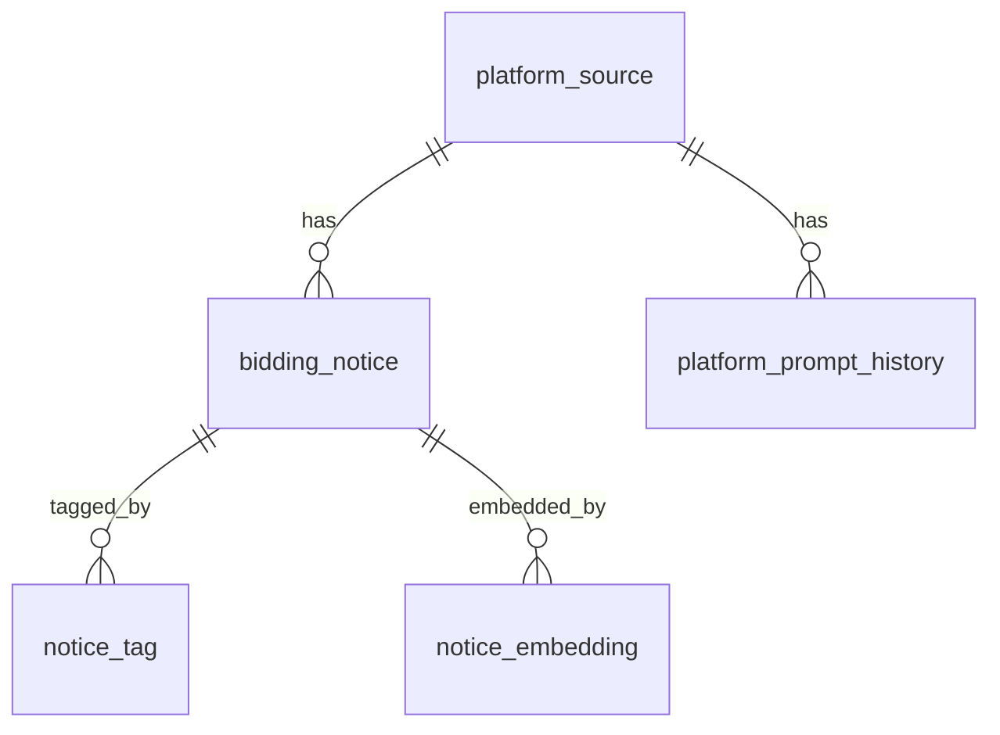
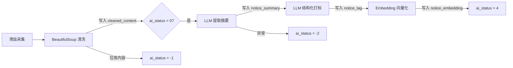

# 客户雷达 — AI-Friendly 招投标数据平台

## 1. 项目定位

为广东佳途科技搭建一套 **AI 原生的招投标信息采集与商机匹配系统**。核心设计理念：数据库从第一行 DDL 开始就为大模型（LLM）和增强检索生成（RAG）优化，让 AI Pipeline 以最低 Token 成本、最高识别准确率处理招投标数据。

## 2. 技术选型

| 层 | 选型 | 理由 |
|---|---|---|
| 数据库 | Supabase (PostgreSQL 15+) | 团队已有 Supabase 经验；内置 Auth / RLS / Realtime |
| AI Pipeline | Python + OpenAI API | 结构化输出 (JSON Mode)；`text-embedding-3-small` 向量化 |
| 全文搜索 | pg_trgm + GIN 索引 | 中文模糊搜索，免装额外分词插件 |
| 语义检索 | JSONB 向量 → 后期迁移 pgvector | 先跑通再优化 |

## 3. 表结构概览

```
platform_source          -- 平台源信息及技术画像
platform_prompt_history  -- 提示词版本历史
bidding_notice           -- 招投标公告（AI 核心数据表）
notice_tag               -- AI 标签（行级存储，支持高效查询）
notice_embedding         -- 向量嵌入（RAG 语义检索）
```

### 3.1 ER 关系



### 3.2 platform_source — 平台画像

记录每个招标网站的技术特征，供 AI 爬虫动态决策。

关键字段：
- `rendering_type` — 告诉爬虫用 requests 还是 Playwright
- `anti_bot_level` / `waf_provider` — 决定是否需要代理池
- `extraction_prompt` + `prompt_version` — 该平台定制化的提取提示词

### 3.3 bidding_notice — 核心数据表

AI 数据分层存储，逐级降本：

| 字段 | 角色 | Token 成本 |
|---|---|---|
| `notice_content` | 原始 HTML 存档 | 最高（万字级） |
| `cleaned_content` | 纯文本，去噪后 | 中等 |
| `notice_summary` | 200 字摘要 | 极低 |
| `notice_tag` (关联表) | 结构化标签 | 零（不走 LLM） |

### 3.4 AI 状态机 (`ai_status`)

```
  0 (待处理)
  │
  ├→ 1 (已清洗) → 2 (已摘要) → 3 (已打标) → 4 (全部完成)
  │
  ├→ -1 (AI 判定为噪声)
  │
  └→ -2 (处理失败，错误记录在 ai_error)
```

支持断点续跑：清洗成功但摘要失败时，不需要从头再来。

## 4. AI Pipeline 流程



### 4.1 各阶段详情

**阶段 1: 采集与清洗**
- Python 爬虫抓取 HTML
- `BeautifulSoup(html, "lxml").get_text()` 去除标签
- 写入 `cleaned_content`，`ai_status → 1`

**阶段 2: 摘要生成**
- 读取 `cleaned_content`（不读原始 HTML，省 90% Token）
- LLM 返回 200 字商机摘要
- 写入 `notice_summary`，`ai_status → 2`

**阶段 3: 结构化打标**
- 使用 OpenAI Structured Outputs / JSON Mode
- 定义 JSON Schema：`tech_keywords[]`, `qualifications[]`, `industry`, `competitors[]`
- 同时写入 `notice_tag`（行级）和 `bidding_notice.ai_tags`（JSONB 缓存）
- `ai_status → 3`

**阶段 4: 向量化**
- 对 `notice_summary` 调用 `text-embedding-3-small`
- 写入 `notice_embedding`
- `ai_status → 4`

### 4.2 平台级 Prompt 定制

不同平台行文风格差异大（医疗 vs 基建 vs IT），提取 Prompt 存在 `platform_source.extraction_prompt`，Pipeline 处理时动态拼接：

```
system_prompt + platform.extraction_prompt + cleaned_content
```

每次 prompt 迭代记入 `platform_prompt_history`，可追溯、可回滚。

## 5. 查询场景

| 场景 | 走什么索引 | 示例 |
|---|---|---|
| 关键词搜标题 | `pg_trgm` GIN | "涉密 华为" |
| 筛选地区+类型 | `idx_notice_filter_composite` | city='广州', type='tender' |
| 按标签查 | `idx_tag_type_value` | qualification='CS4级' |
| 语义相似度 | `notice_embedding` 向量距离 | "找类似鸿蒙开发的项目" |
| 流水线调度 | `idx_notice_ai_status_date` | ai_status=0 AND 近7天 |

## 6. 文件结构

```
customer radar/
├── docs/
│   └── design.md              ← 本文件
└── supabase/
    └── migrations/
        └── 001_init_schema.sql  ← 建表 + RLS + 索引
```
