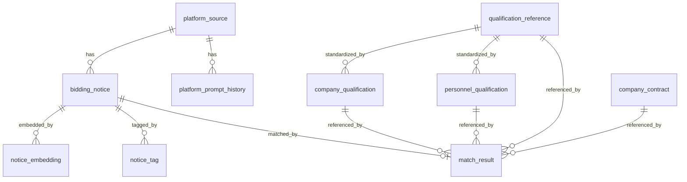
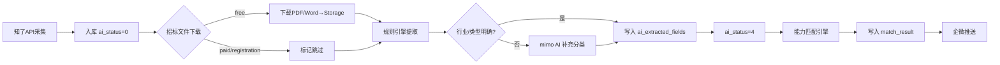

# 客户雷达 — 技术设计文档

> 版本: v2.0 | 日期: 2026-07-03 | 基于 PRD v2.0 修正
> 版本: v5.0 | 日期: 2026-07-04 | 新增关键词策略 v2（高级查询+分组+排除词）
> 版本: v3.0 | 日期: 2026-07-04 | 基于 Phase B 实际验证修正
> 版本: v4.0 | 日期: 2026-07-04 | 新增招标文件自动下载与存储设计
---

## 1. 项目定位

为广东励康信息技术有限公司搭建一套 **招投标情报采集与商机匹配系统**。核心设计理念：

- **业务驱动**：运维/驻场是现金牛，系统围绕这个核心来建
- **AI 原生**：数据库从第一行 DDL 开始就为 LLM 优化，让 AI Pipeline 以最低 Token 成本处理数据
- **匹配为核心**：不只是“看标讯”，而是基于公司能力评估与标讯需求的契合度

### 数据源约束（重要）

**API 限流：** 5次/秒，2000次/分钟。调用间隔 ≥210ms。

**知了标讯 API 只返回元数据，不含招标文件正文。** 实际返回字段：title、bid_type、money_wan、province、city、caller_name、agency_name、sm_names、signup_time、tender_time、url、exists_bid_file 等。`notice_content` 在入库时为空。

**招标文件（含资质要求、评分标准）在原发布网站。** 标讯中的 url 指向知了标讯的中转页面，原发布网站链接在该页面内。获取招标文件的方式因平台而异：

| 获取方式 | 说明 | 处理策略 |
|---|---|---|
| 免费下载 | 部分政府平台直接提供 PDF/Word | 优先获取，提取资质要求 |
| 需要报名 | 需注册并报名后才能下载 | 标记为 `registration_required`，人工跟进 |
| 收费购买 | 招标文件需付费获取 | 标记为 `paid`，跳过 |
| 无法获取 | 链接失效或需特殊权限 | 标记为 `unknown` |

**这意味着：**
1. AI Pipeline 无法从标讯中提取资质要求和评分标准（因为没有招标文件正文）
2. 匹配引擎无法做“逐项扣分”式的精确匹配（不知道具体要求是什么）
3. 当前匹配改为“能力契合度评估”：基于公司已有能力与标讯特征的重叠度打分

---


### 1.1 搜索关键词策略 v2

**API 使用 `query_bids_advanced` 接口（2积分/次），支持 keyword_groups + match_modes + exclude_keywords。**

核心改进（相比 v1 基础 search_bids）：
- 使用 `match_modes: ['sm', 'title']` 精准匹配标的物和标题，大幅降低噪音
- 使用 `keyword_groups` 实现组内 AND、组间 OR 逻辑
- 使用 `exclude_keywords` 排除不相关公告（建筑/施工/监理等）
- 使用 `bid_process: [4]` 只取招标公告，避免重复获取中标/合同
- 按业务线分组，每组独立查询，便于结果分析

**关键词分组（6组，共39个关键词组合）：**

| 分组 | 组合数 | match_modes | 30天命中 | 说明 |
|---|---|---|---|---|
| 核心设备运维 | 10 | sm+title | ~58 | 运维/维保 + 小型机/存储/数据库/服务器/网络 |
| 驻场服务 | 4 | sm+title | ~3 | 驻场+运维/桌面/IT、桌面运维 |
| 通用IT运维 | 7 | sm+title+fulltext | ~0 | IT运维/IT服务/信息技术服务等（正文中匹配） |
| 机房数据中心 | 3 | sm+title | ~1 | 机房运维/数据中心运维 |
| 行业特有 | 3 | sm+title+fulltext | ~163 | 交警/公安+运维/信息化 |
| 品牌产品 | 5 | sm+title+fulltext | ~0 | IBM/Oracle/Power+维保/运维 |

**排除词：** 建筑、施工、监理、装修、幕墙、消防工程、医疗设备、药品、食材、物业保洁、绿化、园林

**积分预算：** 每组 1-3 页，全量采集约 36 积分/次（18 次查询 × 2 积分）。30天覆盖约 225 条公告（去重后约 150-180 条唯一）。

**实测数据（2026-07-04）：**
- 旧策略（search_bids 无 match_modes）：2550 条/30天，大量噪音
- 新策略（query_bids_advanced + keyword_groups）：225 条/30天，高度精准
- 精准度提升约 10 倍

**配置位置：** `src/server/config.js` → `keywordGroups`，可通过 DB `system_config` 表的 `fetch.keyword_groups` 覆盖。

---
## 2. 技术选型

| 层 | 选型 | 理由 |
|---|---|---|
| 前端 | React 18 + Vite + shadcn/ui + Tailwind CSS | 国际化视觉质感，源码级样式可控，响应式灵活 |
| 后端 | Node.js + Express | 与已有项目经验一致 |
| 数据库 | Supabase (PostgreSQL 15+) | 已有经验，RLS/Auth 内置 |
| AI 模型 | 小米 mimo-v2.5-pro | 结构化提取能力强，中文优化好 |
| 全文搜索 | pg_trgm + GIN 索引 | 中文模糊搜索，免装额外插件 |
| 推送 | 企微群机器人 webhook | 零门槛，一行代码 |
| 定时调度 | node-cron | 轻量无依赖 |

---

## 3. 表结构概览

```
platform_source              -- 平台源信息及技术画像（为爬虫扩展预留）
platform_prompt_history      -- 提示词版本历史
bidding_notice               -- 招投标公告（核心数据表）
notice_tag                   -- AI 标签（行级存储）
notice_embedding             -- 向量嵌入（第二阶段）
company_qualification        -- 公司资质证书
personnel_qualification      -- 人员资质证书
match_result                 -- 资格匹配结果
qualification_reference      -- 常用资质参考库（种子数据）
company_contract             -- 公司业绩/合同（同类经验匹配）
```

### 3.1 ER 关系



### 3.2 platform_source — 平台画像

记录每个招标网站的技术特征，供爬虫调度动态决策（第二阶段使用）。

关键字段：
- `spider_strategy` — 爬虫策略标识
- `spider_config` — 爬虫配置 JSON
- `extraction_prompt` + `prompt_version` — 该平台定制化的提取提示词

### 3.3 bidding_notice — 核心数据表

**知了 API 只返回元数据，不含标讯正文。** 字段清单：

| 字段 | 内容 | 来源 |
|---|---|---|
| `title` | 标题 | 知了 API |
| `notice_type` | tender/result/change/candidate | 知了 API bid_type 映射 |
| `budget_amount` | 预算（万元） | 知了 API money_wan |
| `region_scope` / `city` | 省份/城市 | 知了 API |
| `tenderee` | 采购单位 | 知了 API caller_name |
| `tender_agent` | 代理机构 | 知了 API agency_name |
| `source_url` | 知了中转页链接 | 知了 API url |
| `signup_time` | 报名截止 | 知了 API |
| `notice_content` | **始终为空** | 知了 API 不返回正文 |
| `cleaned_content` | **始终为空** | 同上 |
| `ai_extracted_fields` | AI 结构化提取结果 (JSONB) | AI Pipeline v2 写入 |
| `ai_status` | 处理状态 | AI Pipeline 写入 |
| `industry_type` | 行业分类 | AI Pipeline 写入 |
| `data_source` | 数据来源（`zhiliao_api`） | 入库时写入 |
| `doc_access_type` | 招标文件获取方式 (unknown/free/paid/registration_required) | 默认 unknown，后续标记 |

**关键约束**：因为 `notice_content` 始终为空，AI Pipeline 不能做内容级提取（如摘要、资质要求、评分规则）。

### 3.4 AI 状态机 (`ai_status`)

```
  0 (待处理)  →  4 (元数据提取完成)
       │
       └→ -2 (处理失败，错误记录在 ai_error)
```

**v1→v2 变更**：原状态机有 0→1→2→3→4 四步（清洗→摘要→打标→完成），因为 `notice_content` 始终为空，清洗和摘要无意义。v2 简化为 0→4 一步完成。状态 1/2/3 不再使用。

### 3.5 company_qualification — 公司资质表

```sql
CREATE TABLE company_qualification (
  id              SERIAL PRIMARY KEY,
  qual_type       VARCHAR(50) NOT NULL,    -- 资质类型：营业执照/ISO9001/ISO27001/ITSS/CS等
  qual_name       VARCHAR(200) NOT NULL,   -- 资质名称
  qual_level      VARCHAR(50),             -- 等级：一级/二级/三级/甲级/乙级
  cert_number     VARCHAR(100),            -- 证书编号
  issue_date      DATE,
  expiry_date     DATE,                    -- 到期日（用于预警）
  issuing_body    VARCHAR(200),            -- 发证机关
  scope           TEXT,                    -- 覆盖范围描述
  is_active       BOOLEAN DEFAULT TRUE,
  created_at      TIMESTAMPTZ DEFAULT NOW(),
  updated_at      TIMESTAMPTZ DEFAULT NOW()
);
```

### 3.6 personnel_qualification — 人员资质表

```sql
CREATE TABLE personnel_qualification (
  id              SERIAL PRIMARY KEY,
  person_name     VARCHAR(50) NOT NULL,    -- 姓名
  qual_type       VARCHAR(50) NOT NULL,    -- 证书类型：PMP/OCP/RHCE/CCIE/HCIE/软考等
  qual_name       VARCHAR(200) NOT NULL,   -- 证书全称
  cert_number     VARCHAR(100),            -- 证书编号
  issue_date      DATE,
  expiry_date     DATE,
  is_active       BOOLEAN DEFAULT TRUE,
  created_at      TIMESTAMPTZ DEFAULT NOW(),
  updated_at      TIMESTAMPTZ DEFAULT NOW()
);
```

### 3.7 qualification_reference — 资质参考库

IT基础设施服务常用资质标准术语库，包含人员认证（10 大类 80+ 项）和企业资质（5 大类 30+ 项）。

**AI 友好设计：**
- `qual_name` — 标准术语，AI 提取后直接写入
- `match_keywords` — AI 在公告中匹配的关键词数组（如 OCP 匹配 ["Oracle OCP", "OCP证书", "数据库管理员"]）
- `common_aliases` — 常见别名/简称（如 OCP 别名 Oracle认证DBA）
- `search_vector` — GIN 索引，支持模糊匹配

用途：
- 匹配引擎：标准化资质名称对照 + 关键词匹配
- 前端下拉菜单：常用资质选项
- AI 提取：标准术语参考 + 关键词引导

关键字段：
- `category` — 大类（personnel / company）
- `subcategory` — 子类（如服务器与操作系统、IT服务类）
- `qual_name` — 资质/认证名称（标准术语）
- `issuer` — 发证机构
- `match_keywords` — AI 匹配关键词（TEXT[] 数组）
- `common_aliases` — 常见别名（TEXT[] 数组）

### 3.8 company_contract — 公司业绩/合同表

供匹配引擎查询同类项目经验。合同原件由用户本地管理，Hermes Agent 提取结构化数据后通过 CLI/API 写入。

关键字段：
- `service_type` — 服务类型（运维/驻场/集成/桌面/维保/咨询）
- `tech_keywords` — 技术关键词数组，匹配引擎直接使用
- `industry` — 行业分类（银行/医院/政府/交通/电力等）
- `start_date` / `end_date` — 合同起止日期，用于"近N年"判断
- `raw_text` — 合同关键文本，供 AI 匹配时参考
- `ai_extracted` — AI 提取完整结果 JSONB
- `source_file` — 原始文件名，用于本地文件索引

### 3.9 AI 友好字段汇总

| 表 | 字段 | 用途 |
|---|---|---|
| bidding_notice | ai_status | AI 处理状态 (0=待处理, 4=完成, -2=失败) |
| bidding_notice | ai_extracted_fields | AI 提取结果 JSONB (来源标记 source=metadata_rules/metadata_rules+ai) |
| bidding_notice | industry_type | 行业分类 (AI Pipeline 写入) |
| notice_tag | tag_type + tag_value | 标签 (tech_keyword/industry/project_type) |
| notice_tag | confidence | 提取置信度 (0.00-1.00) |
| match_result | match_details | 五维匹配详情 JSONB (维度/得分/满分) |
| match_result | risk_notes | 风险提示 TEXT[] |
| match_result | total_deduction | 距满分差值 (100 - 实际得分) |
| company_contract | tech_keywords | 合同技术关键词，匹配引擎直接使用 |
| company_contract | industry | 合同行业，匹配引擎直接使用 |

### 3.9 match_result — 匹配结果表

```sql
CREATE TABLE match_result (
  id              BIGSERIAL PRIMARY KEY,
  notice_id       BIGINT NOT NULL REFERENCES bidding_notice(id) ON DELETE CASCADE,
  total_deduction DECIMAL(5,2) DEFAULT 0,  -- 预估总扣分
  recommend_level VARCHAR(20) NOT NULL     -- strong/yes/risky/no
    CHECK (recommend_level IN ('strong', 'yes', 'risky', 'no')),
  match_details   JSONB NOT NULL,          -- 逐项匹配详情
  unmatched_items JSONB,                   -- 不满足的条件列表
  risk_notes      TEXT[],                   -- 风险提示
  calculated_at   TIMESTAMPTZ DEFAULT NOW(),
  UNIQUE (notice_id)
);
```

**v2 变更说明**：
- `total_deduction` 语义变更：v1 表示“资质缺失扣分总和”，v2 表示“100 - 能力匹配得分”（兼容旧字段名）
- `match_details` 结构变更：v1 为 `{requirement, matched, deduction}`，v2 为 `{dimension, score, max_score, matched, ...}`
- `unmatched_items`：v2 中不再使用（匹配结果全部在 match_details 中）

### 3.10 system_config — 系统配置表

```sql
CREATE TABLE system_config (
  key         VARCHAR(100) PRIMARY KEY,
  value       JSONB NOT NULL,
  description VARCHAR(500),
  updated_at  TIMESTAMPTZ DEFAULT NOW()
);
```

默认配置项:
| key | 默认值 | 说明 |
|---|---|---|
| `push.schedule` | `0 9,14 * * *` | 企微推送 cron 表达式 |
| `push.webhook_url` | (企微 Webhook URL) | 企微群机器人地址 |
| `push.enabled` | `true` | 推送总开关 |
| `push.daily_summary` | `true` | 日报汇总模式 |
| `fetch.schedule` | `0 12,23 * * *` | 标讯采集 cron 表达式 |

通过 `cr admin config:*` 管理，修改后重启服务生效。

### 3.11 bid_document — 招标文件存储表

存储从原发布网站自动下载的招标文件（PDF/Word），文件本体存 Supabase Storage，元数据存本表。

```sql
CREATE TABLE bid_document (
  id              BIGSERIAL PRIMARY KEY,
  notice_id       BIGINT NOT NULL REFERENCES bidding_notice(id) ON DELETE CASCADE,
  file_name       VARCHAR(255) NOT NULL,        -- 原始文件名
  file_type       VARCHAR(20) NOT NULL,          -- pdf / doc / docx
  file_size       BIGINT,                        -- 字节数
  storage_path    VARCHAR(500) NOT NULL,         -- Supabase Storage 路径 (bid-documents bucket)
  source_download_url TEXT,                      -- 原站原始下载链接
  download_status VARCHAR(20) DEFAULT 'pending'
    CHECK (download_status IN ('pending', 'downloading', 'completed', 'failed')),
  error_message   TEXT,                          -- 下载/解析失败原因
  downloaded_at   TIMESTAMPTZ,
  created_at      TIMESTAMPTZ DEFAULT NOW(),
  updated_at      TIMESTAMPTZ DEFAULT NOW()
);

COMMENT ON TABLE  bid_document IS '招标文件存储表（PDF/Word），文件存 Supabase Storage，本表存元数据';
COMMENT ON COLUMN bid_document.storage_path IS 'Supabase Storage 路径，格式: {notice_id}/{file_name}';
COMMENT ON COLUMN bid_document.download_status IS '下载状态: pending(待下载)/downloading(下载中)/completed(已完成)/failed(失败)';
COMMENT ON COLUMN bid_document.source_download_url IS '原发布网站的原始下载链接（非知了中转页）';
```

**索引：**
- `idx_bid_doc_notice` — notice_id 查询
- `idx_bid_doc_status` — download_status 批量捞取待下载

**关联关系：**
- 一个 bidding_notice 可对应多条 bid_document（同一公告可能有多个文件：正文、附件、答疑等）
- bidding_notice.doc_access_type 仍保留，标记获取方式；bid_document.download_status 标记单个文件的下载状态

**Supabase Storage 配置：**
- Bucket: `bid-documents`
- 路径格式: `{notice_id}/{file_name}`
- 访问策略: service_role 可读写，authenticated 可读

---

## 4. AI Pipeline 流程



### 4.1 各阶段详情

**阶段 1：采集与入库**
- 知了标讯 API 使用 query_bids_advanced 高级查询，按 6 组关键词分组 + match_modes + exclude_keywords 拉取广东省招标公告（详见 1.1 关键词策略 v2）
- 字段映射 + 去重（source_unique_id）
- 写入 bidding_notice，`ai_status = 0`，`notice_content = ''`

**阶段 2：元数据提取（规则引擎 + AI 补充）**

规则引擎从标题+sm_names 提取（无需 AI，快速免费）：
- 技术关键词：14 种模式（小型机/存储/数据库/服务器/网络/虚拟化/桌面/安全/云/机房/ERP/监控/备份/容器）
- 行业分类：8 种模式（金融/医疗/电力能源/交通/教育/政府/通信/制造业）
- 项目类型：7 种模式（运维/驻场运维/桌面运维/系统集成/咨询/安全服务/培训）

仅当规则引擎无法确定行业或项目类型时，调用 mimo AI 补充分类。

**不提取的字段**（因为没有招标文件正文）：
- ~~资质要求 (qualification_requirements)~~
- ~~评分标准 (commercial_scoring_rules)~~
- ~~摘要 (notice_summary)~~

写入 `ai_extracted_fields`，`ai_status → 4`。

**阶段 3：能力匹配引擎（五维评分，满分 100）**

因为没有招标文件的资质要求，无法做“逐项扣分”式匹配。改为评估公司已有能力与标讯需求的契合度：

| 维度 | 满分 | 匹配逻辑 |
|---|---|---|
| 技术关键词 | 30 | 标讯 tech_keywords 与公司资质 scope/名称 + 合同 tech_keywords 的重叠比例 |
| 行业经验 | 25 | 标讯 industry_type 是否在公司合同的 industry 中出现 |
| 项目类型 | 20 | 标讯 project_type 是否在公司合同的 service_type 中出现 |
| 地区匹配 | 15 | 标讯 region 是否在公司合同的 region 中出现（广东省内各市互通） |
| 同类业绩 | 10 | 是否有近 3 年同类合同（服务类型+行业+技术关键词至少匹配 2 项） |

推荐等级：
```
总分 >= 80: 'strong'（强推）
总分 >= 60: 'yes'   （可以投）
总分 >= 40: 'risky' （风险）
总分 <  40: 'no'    （不建议）
```

**当前数据验证**（226 条标讯）：7 strong / 54 yes / 122 risky / 43 no

### 4.2 招标文件自动下载与存储

在 AI Pipeline 元数据提取之前，新增招标文件下载步骤。已下载文件存储在 Supabase Storage（`bid-documents` bucket），元数据记录在 `bid_document` 表。

**下载流程：**

```
bidding_notice (notice_type = 'tender', doc_access_type = 'unknown')
  → get_bid_detail API (source_unique_id)
  → 获取 attachment_urls[]
  → 智能筛选:
      有 ZIP → 只下载 ZIP（含完整招标文件）
      无 ZIP → 下载 PDF/DOCX（可能是代理协议）
  → 下载 → 存入 Supabase Storage
  → 如果是 ZIP → 解压，提取招标文件 PDF/DOCX
  → 记录 bid_document 表
  → 更新 doc_access_type = 'free'
```

**文件类型支持：** PDF、DOC、DOCX、ZIP（自动解压）

**实际数据验证：**
- 约 13% 的标讯有附件（get_bid_detail 返回 attachment_urls 非空）
- 有附件的标讯中，约一半包含 ZIP 文件
- ZIP 内才是完整的招标文件（含评分标准、资质要求）
- 直接附件通常是代理协议 PDF，不含评分标准

**附件类型分析：**

| 附件类型 | 内容 | 价值 |
|---|---|---|
| ZIP | 招标文件全文（含评分标准） | **高** |
| PDF（非 ZIP 内） | 代理协议、补充说明 | 低 |
| DOCX（非 ZIP 内） | 采购需求章节（部分） | 中 |
| PNG | 截图 | 无 |

**约束：**
- 只处理 notice_type = 'tender' 的标讯（中标公告、变更公告无招标文件）
- 有 ZIP 时只下载 ZIP，跳过其他附件（减少无效下载）
- 收费招标文件一律跳过并标记
- 下载失败不影响主 Pipeline
- 单文件上限 50MB

**API 接口：**

| 接口 | 说明 |
|---|---|
| `POST /api/admin/notices/:id/download` | 单条下载 |
| `POST /api/admin/notices/download-batch` | 批量下载（tender 类型） |

**CLI 命令：**

| 命令 | 说明 |
|---|---|
| `cr admin notice:download <id>` | 下载单条标讯的招标文件 |
| `cr admin notice:download --batch` | 批量下载 |

**Pipeline 集成：** 采集入库后、AI 提取前插入文件下载步骤。


### 4.3 评分标准提取与 AI 文件选择策略

从已下载的招标文件中提取评分标准和资质要求，存入 `notice_scoring` 表。

**提取流程：**

```
bid_document (file_type = pdf/docx/doc, download_status = completed)
  → 文件选择（见下方策略）
  → Python 提取文本 (PyPDF2 / python-docx)
  → mimo AI 结构化解析
  → 写入 notice_scoring 表
```

**AI 解析文件选择策略：**

| 优先级 | 条件 | 说明 |
|---|---|---|
| 1 | 文件名含"招标"/"采购文件" + ≥50KB | ZIP 解压出的招标文件全文，最准确 |
| 2 | 文件名含"招标"/"采购文件" + <50KB | 可能是招标文件封面或目录，价值有限 |
| 3 | 最大的 PDF/DOCX + ≥50KB | 可能是完整招标文件 |
| 4 | <50KB 的文件 | **跳过**（封面、授权书、补充说明） |

**文件大小过滤：**
- 最小阈值：50KB（小于 50KB 的文件不是完整招标文件）
- 最大阈值：50MB（超过则跳过）

**为什么需要过滤：**
- <50KB 的文件通常是：封面页、目录、授权书、承诺函、补充说明
- 这些文件不含评分标准，浪费 AI 积分
- 实测 12KB 和 17KB 的文件分别是补充说明和小附件

**评分标准结构：**

```json
{
  "scoring": {
    "total": 100,
    "categories": [
      {
        "name": "技术部分",
        "max_score": 70,
        "items": [
          {"item": "评分项", "score": 18, "rule": "评分规则"}
        ]
      }
    ]
  },
  "qualifications": [
    {"type": "资质类型", "requirement": "具体要求", "mandatory": true}
  ],
  "summary": "评分概述"
}
```

**API 接口：**

| 接口 | 说明 |
|---|---|
| `POST /api/admin/notices/:id/scoring` | 单条提取 |
| `POST /api/admin/notices/scoring-batch` | 批量提取 |

**CLI 命令：**

| 命令 | 说明 |
|---|---|
| `cr admin notice:scoring <id>` | 提取单条评分标准 |
| `cr admin notice:scoring --batch` | 批量提取 |

---

## 5. 查询场景

## 5. 查询场景

| 场景 | 走什么索引 | 示例 |
|---|---|---|
| 关键词搜标题 | `pg_trgm` GIN | "涉密 华为" |
| 筛选地区+类型 | 复合索引 | city='广州', type='tender' |
| 按标签查 | `idx_tag_type_value` | qualification='ISO9001' |
| 按匹配等级查 | `idx_match_level` | recommend_level='strong' |
| 流水线调度 | `idx_notice_ai_status_date` | ai_status=0 AND 近7天 |

---

## 6. 文件结构

```
customer radar/
├── docs/
│   ├── product-requirements.md                    ← 需求文档
│   ├── system-design.md                ← 本文件
│   ├── platform-registry.md      ← 平台清单
│   ├── ai-prompt-templates.md        ← Prompt 模板
│   └── implementation-plan.md    ← 实施计划
├── supabase/
│   └── migrations/
│       ├── 001_init_schema.sql
│       ├── 002_platform_tech_profile.sql
│       ├── 003_enrich_business_fields.sql
│       ├── 004_expand_guangdong_platforms.sql
│       ├── 005_qualification_tables.sql      ← 新增：资质表
│       └── 006_match_result_table.sql        ← 新增：匹配结果表
├── src/
│   ├── server/
│   │   ├── index.js
│   │   ├── config.js
│   │   ├── services/
│   │   │   ├── zhiliao-api.js
│   │   │   ├── ai-pipeline.js
│   │   │   ├── match-engine.js
│   │   │   ├── wecom-notify.js
│   │   │   ├── doc-downloader.js  ← 新增：招标文件下载服务
│   │   │   └── scheduler.js
│   │   └── routes/
│   │       ├── notices.js
│   │       ├── qualifications.js
│   │       ├── match.js
│   │       ├── platforms.js
│   │       └── auth.js
│   ├── client/
│   │   ├── index.html
│   │   ├── src/
│   │   │   ├── App.jsx
│   │   │   ├── pages/
│   │   │   │   ├── Login.jsx
│   │   │   │   ├── ResetPassword.jsx
│   │   │   │   ├── NoticeList.jsx
│   │   │   │   ├── NoticeDetail.jsx
│   │   │   │   ├── QualificationManage.jsx
│   │   │   │   ├── Search.jsx
│   │   │   │   ├── PlatformManage.jsx
│   │   │   │   └── Settings.jsx
│   │   │   ├── components/
│   │   │   └── utils/
│   │   ├── manifest.json
│   │   └── vite.config.js
│   └── cli/
│       ├── bin/
│       │   └── cr.js              ← CLI 入口
│       ├── commands/
│       │   ├── auth.js            ← login/logout
│       │   ├── list.js            ← cr list
│       │   ├── show.js            ← cr show
│       │   ├── search.js          ← cr search
│       │   ├── qual.js            ← cr qual/person
│       │   └── admin/
│       │       ├── qual.js        ← cr admin qual:*
│       │       ├── person.js      ← cr admin person:*
│       │       ├── platform.js    ← cr admin platform:*
│       │       ├── notice.js      ← cr admin notice:*
│       │       ├── push.js        ← cr admin push:*
│       │       └── user.js        ← cr admin user:*
│       ├── lib/
│       │   ├── auth.js            ← 认证工具
│       │   ├── api.js             ← API 请求封装
│       │   └── output.js          ← 输出格式化
│       └── package.json
├── package.json
├── .env
└── .env.example
```
